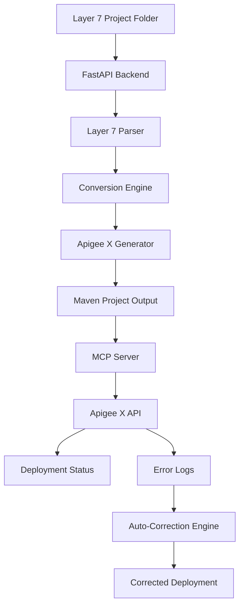

# System Architecture Document
## Layer 7 to Apigee X Migration Tool

### Document Information
**Version**: 1.0  
**Date**: July 21, 2025  
**Status**: Draft

### 1. Architecture Overview

The Layer 7 to Apigee X migration tool consists of three main components:
1. **FastAPI Backend** - REST API for Layer 7 parsing and Apigee X code generation
2. **Conversion Engine** - Core logic for transforming Layer 7 XML policies to Apigee X
3. **MCP Server** - Model Context Protocol server for Apigee X deployment and monitoring



### 2. Component Architecture

#### 2.1 FastAPI Backend
**Purpose**: Main API interface for migration requests
**Technology**: Python FastAPI with async/await

**Key Endpoints**:
- `POST /migrate` - Accept Layer 7 project folder path, return Apigee X Maven project
- `GET /status/{migration_id}` - Check migration status
- `GET /download/{migration_id}` - Download generated Maven project

**Responsibilities**:
- Input validation and sanitization
- File system access for Layer 7 projects
- Orchestration of conversion process
- Result packaging and delivery

#### 2.2 Layer 7 Parser Module
**Purpose**: Parse Layer 7 v11.1 XML policies and project structure

**Components**:
```
layer7_parser/
├── __init__.py
├── project_reader.py      # Read folder structure
├── xml_policy_parser.py   # Parse XML policies
├── service_parser.py      # Parse service definitions
├── models/
│   ├── layer7_policy.py   # Data models for L7 policies
│   └── layer7_service.py  # Data models for L7 services
└── exceptions.py          # Custom parsing exceptions
```

**Supported Layer 7 Artifacts**:
- XML policies (authentication, routing)
- Service definitions
- Folder structure organization
- Basic policy configurations

**Excluded**:
- Certificates and TLS configurations
- Persistent storage configurations
- Cache configurations
- Complex transformation policies

#### 2.3 Conversion Engine
**Purpose**: Transform Layer 7 configurations to Apigee X equivalents

**Architecture**:
```
conversion_engine/
├── __init__.py
├── converter.py           # Main conversion orchestrator
├── policy_mappers/
│   ├── auth_mapper.py     # Basic auth conversion
│   ├── routing_mapper.py  # Routing policy conversion
│   └── javascript_mapper.py # Fallback to JavaScript
├── structure_mapper.py    # Folder to proxy structure
├── templates/
│   ├── proxy_template.xml
│   ├── policy_templates/
│   └── javascript_templates/
└── validation/
    └── apigee_validator.py
```

**Conversion Rules**:
1. **Authentication Policies** → Apigee BasicAuthentication or JavaScript
2. **Routing Policies** → Apigee RouteRule and TargetEndpoint
3. **Unsupported Features** → JavaScript policies with notifications
4. **Folder Structure** → Apigee proxy organization following naming conventions

#### 2.4 Apigee X Generator
**Purpose**: Generate Maven-compatible Apigee X project structure

**Output Structure**:
```
generated_apigee_project/
├── pom.xml                           # Maven configuration
├── src/
│   └── main/
│       └── apigee/
│           ├── proxies/
│           │   └── {api_name}/
│           │       ├── {api_name}.xml
│           │       ├── policies/
│           │       │   ├── BasicAuth-1.xml
│           │       │   ├── RouteToBackend.xml
│           │       │   └── JS-Fallback-*.xml
│           │       ├── targets/
│           │       │   └── default.xml
│           │       └── resources/
│           │           └── jsc/
│           │               └── fallback-*.js
│           └── resources/
│               └── edge/
│                   └── env/
│                       └── test/
├── README.md                         # Generated documentation
└── migration_report.md               # What was converted/excluded
```

**Naming Conventions** (Following Apigee Standards):
- Proxy names: `{original-service-name}-v1`
- Policy names: `{PolicyType}-{Sequence}` (e.g., `BasicAuth-1`)
- Resource names: lowercase with hyphens

#### 2.5 MCP Server for Apigee X
**Purpose**: Deploy and monitor Apigee X proxies via Model Context Protocol

**Capabilities**:
- Deploy Maven projects to Apigee X
- Monitor deployment status and logs
- Support multiple environments (single or multi-env)
- Error detection and reporting

**MCP Tools**:
```python
# Available MCP tools
@mcp.tool("deploy_apigee_proxy")
@mcp.tool("check_deployment_status") 
@mcp.tool("get_apigee_logs")
@mcp.tool("list_environments")
```

### 3. Data Flow Architecture

#### 3.1 Migration Process Flow
1. **Input**: Layer 7 project folder path via FastAPI
2. **Parse**: Extract XML policies and service definitions
3. **Convert**: Transform to Apigee X equivalent structures
4. **Generate**: Create Maven project with proper structure
5. **Package**: Zip and provide download link
6. **Optional**: Deploy via MCP server

#### 3.2 Error Handling Flow
1. **Syntax Errors**: Auto-fix common XML/policy issues
2. **Policy Conflicts**: Remove conflicting elements with notification
3. **Unsupported Features**: Convert to JavaScript with documentation
4. **Critical Failures**: Remove component and continue with notification

### 4. Technology Stack

#### 4.1 Core Technologies
- **Language**: Python 3.11+
- **API Framework**: FastAPI with async/await
- **XML Processing**: lxml, xml.etree.ElementTree
- **Templating**: Jinja2 for code generation
- **MCP Protocol**: Python MCP SDK
- **Packaging**: Python zipfile, shutil

#### 4.2 Dependencies
```python
# Core dependencies
fastapi>=0.104.0
uvicorn[standard]>=0.24.0
lxml>=4.9.3
jinja2>=3.1.2
pydantic>=2.5.0
mcp>=0.1.0  # Model Context Protocol
httpx>=0.25.0  # For Apigee API calls
```

#### 4.3 Apigee X Integration
- **Management API**: For proxy deployment
- **Analytics API**: For monitoring and logs
- **Authentication**: OAuth 2.0 or Service Account keys

### 5. Deployment Architecture

#### 5.1 Development Environment
```
development/
├── backend/              # FastAPI application
├── conversion_engine/    # Core conversion logic  
├── mcp_server/          # MCP server implementation
├── tests/               # Comprehensive test suite
├── samples/             # Layer 7 sample projects
└── docs/                # Technical documentation
```

#### 5.2 Configuration Management
- Environment variables for Apigee X credentials
- Configurable conversion rules
- Template customization support
- Logging configuration

### 6. Security Considerations

#### 6.1 Input Security
- Path traversal protection for Layer 7 folder access
- XML parsing security (XXE prevention)
- Input validation and sanitization

#### 6.2 Apigee X Security
- Secure credential storage
- OAuth 2.0 token management
- API rate limiting compliance

### 7. Error Handling Strategy

#### 7.1 Parsing Errors
- **Malformed XML**: Auto-correction attempts, fallback to exclusion
- **Missing Dependencies**: Clear error messages with suggestions
- **Unsupported Structure**: Graceful degradation with notifications

#### 7.2 Conversion Errors
- **Policy Mapping Failures**: Convert to JavaScript with documentation
- **Structure Conflicts**: Use Apigee conventions, note deviations
- **Resource Limits**: Optimize or split proxies as needed

#### 7.3 Deployment Errors (via MCP)
- **Syntax Errors**: Auto-fix and retry
- **Policy Conflicts**: Remove conflicting policies
- **Resource Errors**: Report and suggest manual intervention

### 8. Performance Considerations

#### 8.1 Scalability
- Async processing for large Layer 7 projects
- Streaming for large file operations
- Caching of conversion templates

#### 8.2 Resource Management
- Memory-efficient XML processing
- Temporary file cleanup
- Connection pooling for Apigee APIs

### 9. Monitoring and Observability

#### 9.1 Logging Strategy
- Structured logging for all components
- Migration audit trails
- Error categorization and metrics

#### 9.2 Metrics
- Conversion success rates
- Processing times
- Error patterns and frequencies

### 10. Future Extensions

#### 10.1 Phase 2 Enhancements
- Support for more Layer 7 policy types
- Advanced transformation capabilities
- Multi-backend routing support
- Enhanced error correction algorithms

#### 10.2 Integration Opportunities
- CI/CD pipeline integration
- IDE plugins for developers
- Batch migration capabilities
- Migration assessment tools
